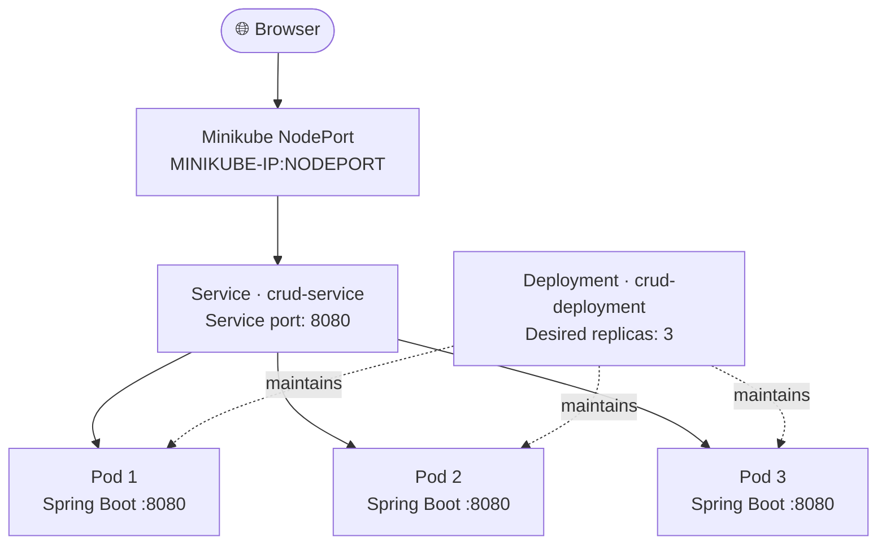
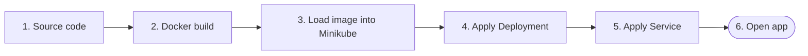

from pathlib import Path

readme = r"""<div align="center">

# ☸️ Spring Boot CRUD on Kubernetes

### Fedora · Docker · Minikube · Kubernetes

**Build → Load → Deploy → Expose → Access**


</div>

---

## 🗺️ Deployment architecture



## 🚀 The workflow



---

## 0 · Install the tools

> **Already installed?** Skip to [Step 1](#1--start-minikube).

### Docker

```bash
sudo dnf install -y docker
sudo systemctl enable --now docker
sudo usermod -aG docker "$USER"
```

Sign out and sign back in after adding your user to the `docker` group.

```bash
docker --version
docker info
```

### kubectl + Minikube

Follow the official installation guides:

| Tool | Installation guide | Verify |
|---|---|---|
| `kubectl` | [Kubernetes tools](https://kubernetes.io/docs/tasks/tools/) | `kubectl version --client` |
| Minikube | [Minikube start guide](https://minikube.sigs.k8s.io/docs/start/) | `minikube version` |

---

## 1 · Start Minikube

```bash
minikube start
minikube status
kubectl get nodes -o wide
```

**Ready check:** the Minikube node should show `Ready`.

---

## 2 · Build and load the image

Run these commands in the project directory containing your `Dockerfile`.

```bash
docker build -t crud:1.0 .
docker images
minikube image load crud:1.0
minikube image ls | grep crud
```

<details>
<summary><strong>💡 Why load the image?</strong></summary>

The host's Docker image store and Minikube's image store are separate in this setup. Minikube uses `containerd`, so loading the image makes `crud:1.0` available to the cluster without pulling it from a registry.

</details>

---

## 3 · Create the Deployment

Create **`crud-deployment.yaml`**:

```yaml
apiVersion: apps/v1
kind: Deployment
metadata:
  name: crud-deployment
spec:
  replicas: 3
  selector:
    matchLabels:
      app: crud
  template:
    metadata:
      labels:
        app: crud
    spec:
      containers:
        - name: crud
          image: crud:1.0
          imagePullPolicy: IfNotPresent
          ports:
            - containerPort: 8080
```

Apply it and wait for the rollout:

```bash
kubectl apply -f crud-deployment.yaml
kubectl rollout status deployment/crud-deployment
kubectl get pods -o wide
```

### What connects to what?

| YAML field | Purpose |
|---|---|
| `replicas: 3` | Kubernetes maintains three Pods |
| `app: crud` | Connects the Deployment selector, Pod labels, and Service selector |
| `image: crud:1.0` | Image used to create each container |
| `containerPort: 8080` | Documents the app's container port; it does not publish a Fedora host port |

Expected: **3 Pods** in `Running` state, each showing `1/1` ready.

---

## 4 · Create the NodePort Service

Create **`crud-service.yaml`**:

```yaml
apiVersion: v1
kind: Service
metadata:
  name: crud-service
spec:
  type: NodePort
  selector:
    app: crud
  ports:
    - protocol: TCP
      port: 8080
      targetPort: 8080
```

Apply it:

```bash
kubectl apply -f crud-service.yaml
kubectl get svc crud-service
```

### Understand the ports

| Setting | Meaning |
|---|---|
| `port: 8080` | Port exposed by the Service inside the cluster |
| `targetPort: 8080` | Port on the Spring Boot containers |
| `NodePort` | Port used to reach the Service through the Minikube node |

Example output from this setup:

```text
NAME           TYPE       CLUSTER-IP      EXTERNAL-IP   PORT(S)
crud-service   NodePort   10.104.1.217    <none>        8080:31345/TCP
```

Here, **`31345` is an example NodePort**. Your assigned port may differ.

---

## 5 · 🌐 Access the application

Get the current values:

```bash
minikube ip
kubectl get svc crud-service
```

Example values:

| Setting | Example |
|---|---|
| Minikube IP | `192.168.49.2` |
| NodePort | `31345` |
| Application URL | `http://192.168.49.2:31345` |

Open this example URL in your browser:

**[http://192.168.49.2:31345](http://192.168.49.2:31345)**

> Use the IP and NodePort reported by your own commands. The example values may change.

### If the NodePort URL does not open

**Option A — Ask Minikube to open the Service**

```bash
minikube service crud-service
```

**Option B — Forward a local port**

```bash
kubectl port-forward service/crud-service 8080:8080
```

Then open **http://localhost:8080** while the command is running.

---

## 6 · 🔍 Troubleshooting

| Symptom | Check / action |
|---|---|
| `ImagePullBackOff` | Run `minikube image load crud:1.0`; check the image tag |
| Pods are not ready | Run `kubectl describe pod <pod-name>` and `kubectl logs deployment/crud-deployment` |
| URL does not open | Recheck `minikube ip` and `kubectl get svc crud-service` |
| Service has no endpoints | Ensure the Pods have label `app: crud` and the Service selector matches |
| YAML error | Use spaces, not tabs |
| `404 Not Found` | The server may be reachable, but `/` may not be mapped; try an actual CRUD endpoint |

### Handy diagnostic commands

```bash
kubectl get nodes -o wide
kubectl get deployments
kubectl get pods -o wide
kubectl get svc
kubectl get endpoints crud-service
kubectl logs deployment/crud-deployment
kubectl describe pod <pod-name>
```

---

## 7 · 🔄 Rebuild after changing your code

After rebuilding the same image tag, load it into Minikube and restart the Deployment:

```bash
docker build -t crud:1.0 .
minikube image load crud:1.0
kubectl rollout restart deployment/crud-deployment
kubectl rollout status deployment/crud-deployment
```

---

## ⚠️ Local access is not public hosting

`192.168.49.2` is a private/local address in this setup. **NodePort does not automatically make the app accessible over the public Internet.** Public hosting requires a publicly reachable host plus suitable networking, firewall, DNS, and HTTPS configuration.

---

## ⚡ Quick command reference

Run from the project directory:

```bash
# Start the local cluster
minikube start

# Build and transfer the image
docker build -t crud:1.0 .
minikube image load crud:1.0

# Deploy the app and expose it
kubectl apply -f crud-deployment.yaml
kubectl apply -f crud-service.yaml

# Verify and get the access details
kubectl get pods
kubectl get svc crud-service
minikube ip
```

Build your URL using the current values:

```text
http://<MINIKUBE-IP>:<NODEPORT>
```

<div align="center">

**Built with Spring Boot · Docker · Kubernetes · Minikube**

</div>
"""

path = Path("/mnt/data/README.md")
path.write_text(readme, encoding="utf-8")
print(f"Created: {path}")
print(f"Size: {path.stat().st_size:,} bytes")
